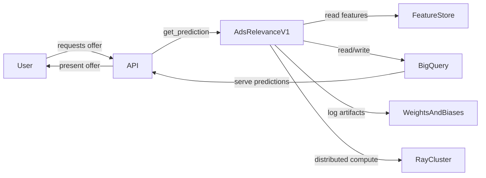
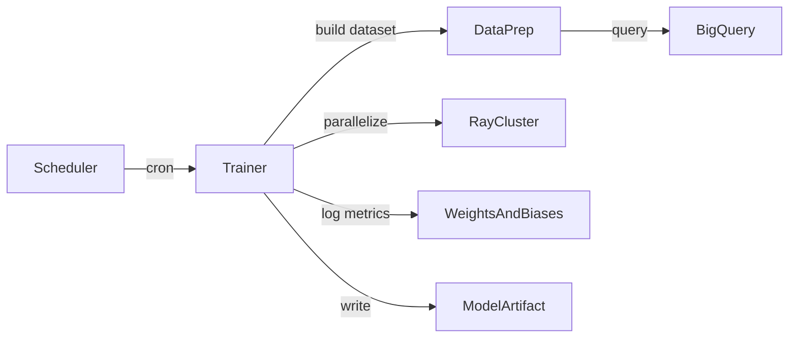

# Docs Quickstart Generator

Detailed instructions for the **quickstart** mode.

Generate one-screen, high-signal onboarding docs for a concrete module path, with correct file placement, minimal yet legible diagrams, and a final editorial pass to remove speculation and redundancy.

---

## Inputs

Gather these from the user or infer from context:

| Input | Description | Example |
|-------|-------------|---------|
| `feature_dir` | Repo-relative path | `discord_ai/models/py/nitro_offer_machine_v2` |
| `tech_stack` | Languages, frameworks, services | `Python, Dagster, Ray, BigQuery` |
| `scope` | Modules covered | `training, scoring, serving surface` |
| `known_docs` | Existing related docs (optional) | `../readme.md, ../../infra/dagster/README.md` |

---

## Pathing & Placement (Must-Follow)

- Write all outputs under: `<feature_dir>/docs/`
- **Never** write to repo root `docs/` unless `feature_dir` is actually the repo root
- If the directory doesn't exist, create it
- Preserve existing filenames if files already exist

---

## File Structure

```
tour.md           # Quickstart + module overview (entry point)
architecture.md   # Structure with diagrams
interfaces.md     # Public API, events, types
data.md           # Tables, cache keys, invariants (only if applicable)
exercises.md      # Learning exercises (max 5 tasks)
tests.md          # Only if tests actually exist
README.md         # Human progression index
AGENTS.md         # Agent routing index
```

Every generated file gets YAML frontmatter (id, title, description, index[]).

Example for tour.md:
```yaml
---
id: tour
title: Module Tour
description: >
  Quickstart and module overview. Entry point for onboarding.
index:
  - id: purpose
  - id: run-it-now
  - id: happy-path
  - id: code-map
  - id: reading-guide
---
```

### Doc Type Classification

| File | Doc Type | Purpose |
|------|---------------|---------|
| tour.md | tutorial | Entry point, learn by following |
| architecture.md | explanation | Understand the system design |
| interfaces.md | reference | Lookup API, types, events |
| data.md | reference | Lookup data model, invariants |
| exercises.md | tutorial | Learn by doing |
| tests.md | how-to | Accomplish testing tasks |

### Scale-Aware Placement

Place generated files into intent folders (e.g., `docs/tutorials/tour.md`, `docs/reference/interfaces.md`). Create a folder as soon as any doc of that type is identified. Only create a folder when there's at least one doc for it (no empty folders).

---

## Part 1: tour.md (Entry Point)

**Output**: `<feature_dir>/docs/tour.md`

Combines the hands-on quickstart with a module overview so a newcomer can orient and get running in one file.

**Include (≤500 words of prose + one diagram; diagram markup does not count toward word limit)**:

1. **Purpose & scope** — one sentence
2. **Where it lives** — key repo paths and entrypoints
3. **Run it now** — one copy-paste command or single request; ask before running anything long-lived or side-effecting. If all primary commands are side-effecting, prefer a read-only or help command (e.g., `--help`, `status`, `--version`)
4. **Happy path flow** — a Mermaid flowchart (not C4) with ≤8 nodes, LR direction, no parentheses in node text
5. **Terminology** — table of domain terms (only if they're non-obvious)
6. **Code map** — table of key files/modules with roles
7. **Reading guide** — explicit ordered list linking to the other docs in this folder

**Style**: Concise, factual, imperative voice. Prefer examples over prose.

---

## Part 2: Module Docs (Understanding)

**Output dir**: `<feature_dir>/docs/`

Organize by progressive depth. Keep each file ≤ one screen. Prefer links to deeper sources over duplication.

### architecture.md

**Goal**: Communicate structure with **as few diagrams as possible**.

- Prefer **Mermaid `flowchart LR`**
- Only add a **sequence diagram** if it materially clarifies a key interaction
- **Cap total diagrams to 5 (max)**: suggest (a) System overview, (b) 1–2 component slices, (c) 1–2 sequence diagrams for key flows
- **Break complex systems** into separate small diagrams; do not output one giant connected graph
- **C4 diagrams are supported**. Use Mermaid C4 (`C4Context`, `C4Container`) when it clarifies structure; otherwise use standard flowchart

**Example — System overview**:

Updated: 2025-10-22

**Example — Component slice: Training pipeline**:

Updated: 2025-10-22

### interfaces.md

Public API, events, types, pre/post-conditions, error codes, feature flags.

The most important code interfaces to know and their roles.

### data.md (Only If Applicable)

Tables/models, cache keys, invariants (e.g., `status ∈ {draft, live}`). If the module has no meaningful data structures, persistence, or cache — omit this file.

### exercises.md

Treat as learning exercises. Select up to 5 that cover key developer workflows and aid in understanding the code.

Include succinct step-by-step guidance that leaves the reader to explore and understand.

**Replace speculative change guides with practical learning tasks**:
- Trace a full request path from entrypoint to persistence
- Identify one key validation or business rule and find where it's implemented
- Add a simple debug log or inspect state transitions (in local/dev mode only)
- Run an ML training loop in debug/minimal data mode

### tests.md (Only If Tests Exist)

- Understand the testing setup and conventions applied throughout
- Commands to run tests (attempt to verify these yourself). If you can't figure it out, mention what you tried and your best guess
- List real test commands and fixtures that exist now
- **If no tests exist, omit this file entirely**

### Index Generation

After generating all content files, create the two index files:

**`docs/README.md`** -- Human progression order:
1. tour.md (start here)
2. architecture.md (understand the system)
3. interfaces.md / data.md (lookup references)
4. exercises.md (practice)
5. tests.md (testing workflows)

**`docs/AGENTS.md`** -- Agent routing by doc type, with frontmatter. Group files by type (tutorials, how-to, explanation, reference) in tables.

See `references/docs-structure.md` for full index format.

---

## Diagram Guardrails

| Rule | Rationale |
|------|-----------|
| ≤10 nodes per diagram | Keeps diagrams readable |
| LR direction | Consistent flow |
| No parentheses `()` in node text | Avoids renderer issues |
| Descriptive but concise labels | Avoid generic names and heavy jargon |
| Arrow labels allowed (1–3 words) | Adds clarity |
| One arrow style, consistent nouns | Visual consistency |
| Add `Updated: YYYY-MM-DD` below each | Track freshness |
| Use `subgraph` to group when helpful | Organize internal components |

**Validation**: Check that diagrams render locally; if they don't, fall back to simpler shapes and fewer nodes.

---

## Behavior Guidelines

- Don't speculate; use **UNKNOWN** where details are missing
- Ask before running any long-lived or side-effecting processes
- Avoid blocking tasks; prefer short validation or dry-runs
- Keep every page to two screens or fewer; link deeper where necessary

---

## Final Editorial Pass (Must Do)

Before finishing, rewrite or remove:
- Any unverified or speculative detail
- Redundant content across files (dedupe into one source and link)
- Verbose explanations that don't change decisions or actions

**Checklist**:
- [ ] Files live under `<feature_dir>/docs/` with descriptive names (no numeric prefixes)
- [ ] `tour.md` has a reading guide linking all other files in order
- [ ] ≤2 screens per file; ≤5 diagrams total; diagrams render
- [ ] `data.md` present only if module has meaningful data structures, persistence, or cache
- [ ] `tests.md` present only if tests exist
- [ ] Terminology table has only domain-relevant terms
- [ ] Every generated file has frontmatter (id, title, description, index[])
- [ ] `docs/README.md` and `docs/AGENTS.md` indexes generated
- [ ] Verification script passes (see SKILL.md Verification section for how to run it), or report failures
