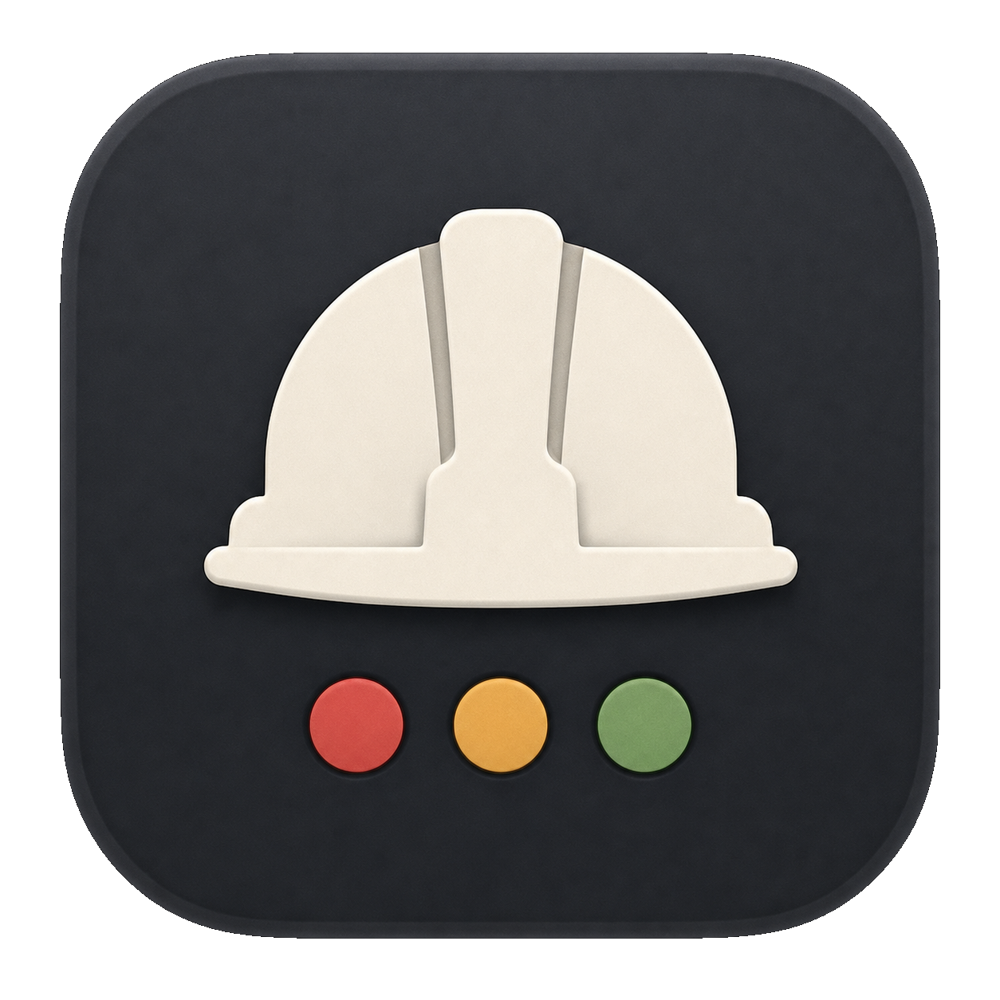

# foreman

<p align="center">
  
</p>

Foreman is a terminal console and native macOS control app for supervising AI
agents that are running in tmux.

It gives one operator view over Claude Code, Codex CLI, Pi, Gemini CLI, and
OpenCode panes. The dashboard groups tmux sessions, shows which panes are
stable or need attention, lets you jump directly to the right pane, and can
wire native status hooks for the harnesses that support them. The optional
native macOS app packages that same control plane as `Foreman.app` for a global
hotkey, Spotlight/Raycast launch, quick search, preview, compose/send, and pane
focus from outside the terminal.

## Why operators use it

- One dashboard for agent panes instead of spelunking through tmux windows.
- Native hook signals for Claude Code, Codex, and Pi when they are wired;
  lower-confidence compatibility detection when they are not.
- Fast operator actions: focus a pane, compose input, search/filter, inspect
  status provenance, and get desktop notifications when work finishes or needs
  attention.

## Quick Start

Requirements:

- `tmux`
- Rust toolchain with `cargo`
- `mise` for repo tasks

Install the local binaries:

```bash
mise run setup
mise run install-local
```

Wire the current repo and user-level harness config, then check the result:

```bash
foreman --setup --user --project
foreman --doctor
foreman
```

Success signal: `foreman --setup` ends with `Next` steps, `foreman --doctor`
prints Machine/Config/Repo/Runtime findings, and a ready setup has no `ERROR`
lines. `WARN` lines are still useful: they tell you which panes are running in
fallback mode or which hook wiring needs a restart. `foreman` should open the
operator dashboard; press `?` there for the key map and status legend.

To try Foreman from the checkout without installing:

```bash
mise run dev
```

The native macOS app is optional; install it from the dedicated section below
when you want global-hotkey and launcher access.

The CLI install task provides:

- `foreman`
- `foreman-claude-hook`
- `foreman-codex-hook`
- `foreman-pi-hook`

## Dashboard Basics

Common keys:

| Key | Action |
|---|---|
| `j` / `k` | Move through the tree |
| `Tab` or `1` / `2` / `3` | Switch panel focus |
| `i` | Compose input for the actionable agent row |
| `f` | Focus tmux on the selected actionable pane |
| `Enter` | Send in compose mode, or act on the selected row |
| `/` | Search |
| `o` | Cycle `stable` and `attention->recent` sort modes |
| `s` / `S` | Start flash jump, optionally focusing tmux |
| `h` | Cycle visible harness families |
| `H` / `P` | Reveal non-agent sessions or panes |
| `t` | Cycle themes |
| `?` | Open help and status legend |

Status labels include their source. `native hook` means Foreman read a
structured harness signal. `compatibility heuristic` means Foreman inferred
state from tmux-visible behavior and treats it as lower confidence.

## Native macOS App

The macOS app is a Swift/AppKit/SwiftUI client for Foreman's Rust control API.
It does not reimplement tmux discovery; it calls `foreman agents --json`,
`foreman focus --pane ... --json`, and `foreman send --pane ... --json`.

Local install/reset:

```bash
mise run install-macos-overlay-app
open -a Foreman
```

Use the app for:

- global hotkey access to Foreman from anywhere
- type-to-search over agent panes
- attention/recent sorting and filters
- detail preview and pull request cards
- compose/send to a selected pane
- double-click or Enter/Focus to jump the terminal to a pane

For development and validation:

```bash
swift test --package-path apps/macos-overlay
mise run validate-macos-overlay-change
```

Run `mise run install-macos-overlay-app` after validation before manual
Spotlight/Raycast testing; validation builds a repo-local app bundle, and the
install task unregisters and removes that dist copy so macOS launchers see only
`~/Applications/Foreman.app`.

See [macOS Overlay App Bundle](docs/macos-overlay/app-bundle.md) and
[macOS Overlay Validation](docs/macos-overlay/validation.md) for details.

## Native Harness Support

| Harness | Compatibility mode | Native mode |
|---|---:|---:|
| Claude Code | yes | yes |
| Codex CLI | yes | yes |
| Pi | yes | yes |
| Gemini CLI | yes | no |
| OpenCode | yes | no |

Run setup after installing Foreman to wire native hooks:

```bash
foreman --setup --user --project
```

If an existing pane was started before hook wiring changed, restart that agent
pane. Setup updates files; it does not repair already-running processes.

See [Operator Guide](docs/operator-guide.md) for setup scopes, doctor fixes,
native hook examples, notification config, UI preferences, and troubleshooting.

## Notifications

Foreman can notify on completion and attention states through configured desktop
backends. On macOS, `alerter` is the preferred backend because click actions can
focus the related tmux pane. Custom macOS notification sounds can use
`notification-sounds:<prefix>` so playback stays on the notification path
instead of direct `afplay` audio.

See [Operator Guide](docs/operator-guide.md#notifications) for the full config.
That guide includes both macOS custom sound routes: direct file playback and
the `alerter --sound` notification-sound prefix path that better respects Focus
/ Do Not Disturb.

## Demo


## Docs

- [Operator Guide](docs/operator-guide.md) - install, setup, dashboard, config,
  hooks, notifications, and troubleshooting
- [Repo Tour](docs/tour.md) - first read for contributors
- [Workflow Guide](docs/workflows.md) - HK lifecycle, validation ladder, and
  release process
- [Architecture](docs/architecture.md) - system boundaries and module map
- [macOS App Bundle](docs/macos-overlay/app-bundle.md) - build, install, launch, and validate `Foreman.app`
- [macOS Overlay Architecture](docs/macos-overlay/architecture.md) - Swift app boundaries and control API seams
- [Changelog](CHANGELOG.md) - release history

## Development

```bash
git checkout -b feat/<slug>
hk start <slug> --plan "Describe the intended change" --target .
mise run check
```

Useful tasks:

| Command | Purpose |
|---|---|
| `mise run setup` | Install dependencies and prepare the environment |
| `mise run fmt` | Auto-format code |
| `mise run lint` | Run lint checks |
| `mise run typecheck` | Run static type analysis |
| `mise run test` | Run Rust tests |
| `mise run build` | Build release binaries |
| `mise run check` | Fast quality gate |
| `mise run verify` | Heavy validation |
| `mise run verify-release` | Release-confidence operator gauntlet |
| `mise run pr-preflight` | Large-PR checklist and cheap merge-prep guardrails |
| `mise run plan -- <slug>` | Legacy shim that points new work to HK |
| `mise run validate-macos-overlay-change` | Required validation for macOS overlay/app/control-API changes |
| `mise run install-macos-overlay-app` | Build, install, and reset `~/Applications/Foreman.app` |
| `mise run verify-macos-overlay-app` | Non-activating app-bundle smoke test |
| `mise run native-preflight` | Check local real-harness readiness |
| `mise run verify-native` | Real Claude, Codex, and Pi E2E drill |
| `mise run verify-ux` | TUI runtime smoke and UX artifact refresh |

CI calls `mise run ci`, which maps to the fast check gate.
