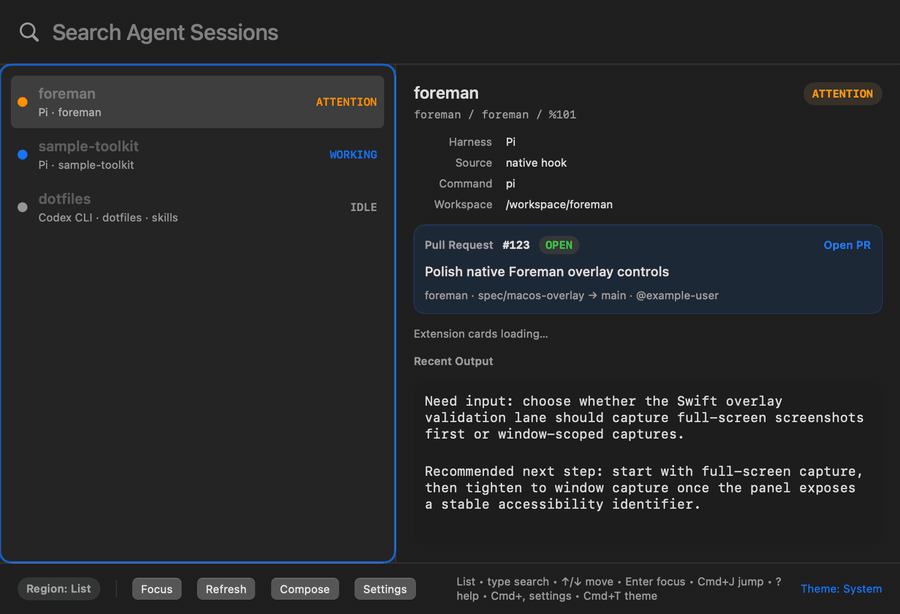

# Foreman

<p align="center">
  
</p>

Foreman is a terminal console and native macOS control app for supervising AI
coding agents that run in tmux.

It gives one user view over Claude Code, Codex CLI, Pi, Gemini CLI, and
OpenCode panes. The dashboard groups tmux sessions, shows which panes are stable
or need attention, lets you jump directly to the right pane, and can wire native
status hooks for the harnesses that support them. The optional native macOS app
packages that same control plane as `Foreman.app` for a global hotkey,
Spotlight/Raycast launch, quick search, preview, compose/send, and pane focus
from outside the terminal.

Current crate version: `1.5.0`

Use Foreman when you have more than one agent session running and need a control
surface. If you only need to inspect an ordinary tmux tree, tmux itself is the
better tool.

## Pick your path

| Path | Use it when | First useful command |
|---|---|---|
| Terminal dashboard | You live in tmux and want the full Ratatui console | `foreman` |
| macOS app | You want a global hotkey, Spotlight/Raycast launch, search, preview, and pane focus outside the terminal | `open -a Foreman` |
| Control API | You want scripts or native clients to read Foreman's tmux pane list | `foreman agents --json` |

Build Foreman from this source checkout. Version tags publish release artifacts.
Don't assume a package registry install unless a release note or local workflow
verifies it.

## Demo

The real Swift renderer creates the macOS overlay demo from fixture agent data.
That keeps the demo deterministic without recording a live desktop.



The terminal dashboard demo records the terminal UI with `vhs`:


## Why users use it

- One dashboard for agent panes instead of spelunking through tmux windows.
- Native hook signals for Claude Code, Codex, and Pi when they're available.
- Lower-confidence fallback detection when they aren't.
- Fast user actions: focus a pane, compose input, search/filter, inspect
  status provenance, and get desktop alerts when work finishes or needs
  attention.
- Optional PR cards, linked repos, and extension-provider cards for
  adjacent context without opening each repo by hand.

## Quick start: terminal dashboard

Requirements:

- `tmux`
- Rust toolchain with `cargo`
- `mise` for repo tasks

Install the local CLI binaries:

```bash
mise run setup
mise run install-local
```

That installs:

- `foreman`
- `foreman-claude-hook`
- `foreman-codex-hook`
- `foreman-pi-hook`

Wire user-level and current-repo harness provider files, then inspect the
result:

```bash
foreman --setup --user --project
foreman --doctor
foreman
```

Success signal: `foreman --setup` ends with `Next` steps, `foreman --doctor`
prints Machine/Config/Repo/Runtime findings, and a ready setup has no `ERROR`
lines. `WARN` lines are still useful: they tell you which panes are running in
fallback mode or which hook wiring needs a restart. `foreman` should open the
user dashboard. Press `?` there for the key map and status legend.

`foreman --setup` is safe to rerun. It writes hook and config files, but it
won't repair agent panes that are already running. Restart affected panes after changing hook
wiring.

To try the dashboard from the checkout without installing:

```bash
mise run dev
```

### Unattended agent setup and resume

Remote coding agents should use the repo-owned machine interface instead
of reconstructing setup and readiness from prose:

```bash
./.agents/setup   # idempotent setup + strict doctor receipt
./.agents/resume  # read-only checkout, doctor, HK, and log status
```

Both commands reserve stdout for one versioned JSON document and send human
details to stderr. Run `mise run verify-agent-entrypoints` to exercise them
against real mise, Foreman, Git, and HK binaries in an isolated disposable clone.
See the [workflow guide](docs/workflows.md#unattended-agent-entrypoints) for
schemas, exit behavior, and path-resolution rules.

## Native macOS app

The macOS app is a Swift/AppKit/SwiftUI client for Foreman's Rust control API.
It doesn't reimplement tmux discovery. It calls `foreman agents --json`,
`foreman focus --pane ... --json`, and `foreman send --pane ... --json`.

Use the app for:

- global hotkey access to Foreman from anywhere
- type-to-search over agent panes
- attention/recent sorting and filters
- detail preview and pull request cards
- compose/send to a selected pane
- double-click or Enter/Focus to jump the terminal to a pane

Local install/reset:

```bash
mise run install-macos-overlay-app
open -a Foreman
```

The install task builds `apps/macos-overlay`, installs
`~/Applications/Foreman.app`, and removes stale local development bundles so
macOS launchers don't open an old app.

Run this after changing overlay code and before manual Spotlight/Raycast testing:

```bash
mise run validate-macos-overlay-change
mise run install-macos-overlay-app
open -a Foreman
```

See [macOS App Bundle](docs/macos-overlay/app-bundle.md),
[macOS Overlay Architecture](docs/macos-overlay/architecture.md), and
[macOS Overlay Checks](docs/macos-overlay/validation.md) for the deeper app
workflow.

## Displayed information

Foreman starts from live tmux pane list and layers higher-confidence signals on
top of it.

- **Pane list**: tmux sessions, windows, panes, titles, working directories, and
  captured preview lines.
- **Harness identity.** Foreman recognizes Claude Code, Codex CLI, Pi, Gemini CLI,
  OpenCode, and non-agent panes when you ask for all panes.
- **Status**: working, idle, needs attention, error, or unknown.
- **Provenance**: whether status came from a native hook or from fallback
  heuristics.
- **Actions**: focus tmux, send input, search/filter, inspect details, and open
  related PR/provider context.

`native hook` means Foreman read a structured harness signal. `compatibility
heuristic` means Foreman inferred state from tmux-visible behavior and treats it
as lower confidence.

## Dashboard basics

Run:

```bash
foreman
```

Common keys:

| Key | Action |
|---|---|
| `j` / `k` | Move through the tree |
| `Tab` or `1` / `2` / `3` | Switch panel focus |
| `i` | Compose input for the actionable agent row |
| `f` | Focus tmux on the selected actionable pane |
| `Enter` | Send in compose mode, or act on the selected row |
| `/` | Search |
| `o` | Cycle `stable` and `attention->recent` sort modes |
| `s` / `S` | Start flash jump, optionally focusing tmux |
| `h` | Cycle visible harness families |
| `H` / `P` | Reveal non-agent sessions or panes |
| `t` | Cycle themes |
| `?` | Open help and status legend |

`Attention → Recent` isn't a pure recency sort. It keeps urgent panes above idle
panes, then uses real pane/native-signal activity as the recency tiebreaker.

## Native harness support

| Harness | Fallback mode | Native mode |
|---|---:|---:|
| Claude Code | yes | yes |
| Codex CLI | yes | yes |
| Pi | yes | yes |
| Gemini CLI | yes | no |
| OpenCode | yes | no |

Wire native hooks after installing Foreman:

```bash
foreman --setup --user --project
foreman --doctor
```

Use `--repo` when the repo to diagnose or wire isn't your current directory:

```bash
foreman --setup --project --repo /path/to/repo
foreman --doctor --repo /path/to/repo
```

Restart any agent pane that predates a hook-wiring change. Setup updates files,
but it won't repair a process that's already running.

See [User Guide](docs/operator-guide.md) for setup scopes, doctor fixes,
native hook examples, alert config, UI preferences, and troubleshooting.

## Pull requests, provider cards, and linked repos

Foreman's JSON control API can attach PR metadata and read-only extension cards:

```bash
foreman agents --json --pull-requests
foreman agents --json --extensions
```

The macOS app renders PR/pane list first, then asks for extension cards only for
the selected pane:

```bash
foreman extensions --pane %42 --json
```

The included Harness Kit provider example maps `hk brief --json` and
`hk status --json` into lifecycle cards such as `NEEDS VALIDATION`,
`NEEDS REVIEW`, `NEEDS SYNC`, `READY`, and `NO WORK`. Foreman only reads these
cards. It copies or opens commands and evidence, but it doesn't run mutating HK commands
such as `hk sync`, `hk export`, or `hk ready`.

Install and operate the provider from
[Harness Kit Provider](docs/providers/harness-kit.md).

If an agent pane runs from notes, Obsidian, scratch space, or a launcher
directory while the relevant code lives elsewhere, link the pane explicitly:

```bash
foreman links add --pane %82 --repo ~/git_repositories/foreman --json
foreman links list --json
foreman links remove --pane %82 --json
```

Foreman still displays the pane's real working directory as `Workspace`, but
pull-request lookups and extension providers use the linked repo. A pane
working-directory fingerprint prevents a stale tmux pane ID from silently
pointing at the wrong repo.

## Alerts

Foreman can send desktop alerts for completion and attention states. On
macOS, `alerter` is the preferred backend because alert clicks can focus
the related tmux pane. Custom alert sounds can use
`notification-sounds:<prefix>` so playback stays on the alert path instead
of direct `afplay` audio.

See [User Guide—Alerts](docs/operator-guide.md#alerts) for
config, custom sound routes, and troubleshooting. That guide includes both
macOS custom sound routes: direct file playback and the `alerter --sound`
alert-sound prefix path that better respects `Focus / Do Not Disturb`.

## Control API for scripts and clients

The Rust CLI is also the control API used by `Foreman.app` and scripts:

```bash
foreman agents --json
foreman agents --json --all-panes
foreman agents --json --pull-requests
foreman agents --json --extensions
foreman extensions --pane %42 --json
foreman focus --pane %42 --json
foreman send --pane %42 --text "continue" --json
```

Use `foreman <command> --help` for the exact contract. These commands are the
stable seam for clients. The tmux scraping and native signal details stay behind the
CLI.

## Docs

- [Docs index](docs/README.md)—start here for the durable docs map
- [User Guide](docs/operator-guide.md)—setup, dashboard, config, hooks,
  alerts, extension providers, and troubleshooting
- [Repo Tour](docs/tour.md)—contributor-oriented code map and reading order
- [Workflow Guide](docs/workflows.md)—HK lifecycle, checks ladder, release
  process, and `.ai/` policy
- [Architecture](docs/architecture.md)—system boundaries and module map
- [macOS App Bundle](docs/macos-overlay/app-bundle.md)—build, install, launch,
  and validate `Foreman.app`
- [macOS Overlay Architecture](docs/macos-overlay/architecture.md)—Swift app
  boundaries and control API seams
- [Harness Kit Provider](docs/providers/harness-kit.md)—install and operate
  the read-only HK provider
- [Changelog](CHANGELOG.md)—release history

## Development

Start meaningful work on a branch and track it with Harness Kit:

```bash
git checkout -b feat/<slug>
hk start <slug> --plan "Describe the intended change" --target .
mise run check
```

Useful tasks:

| Command | Purpose |
|---|---|
| `mise run setup` | Install dependencies and prepare the environment |
| `mise run fmt` | Auto-format code |
| `mise run lint` | Run lint checks |
| `mise run typecheck` | Run static type analysis |
| `mise run test` | Run Rust tests |
| `mise run build` | Build release binaries |
| `mise run check` | Fast quality gate. This is what CI calls |
| `mise run verify` | Heavy checks, including release/UX evidence |
| `mise run verify-release` | Release-confidence user gauntlet |
| `mise run pr-preflight` | Large-PR checklist and cheap merge-prep guardrails |
| `mise run validate-macos-overlay-change` | Required lane for macOS app, overlay, keyboard/focus, screenshot, or control-API changes |
| `mise run capture-macos-overlay-demo` | Regenerate the deterministic macOS overlay demo animation and video. Requires `ffmpeg` |
| `mise run install-macos-overlay-app` | Build, install, and reset `~/Applications/Foreman.app` |
| `mise run verify-macos-overlay-app` | Non-activating app-bundle smoke test |
| `mise run native-preflight` | Check local real-harness readiness |
| `mise run verify-native` | Opt-in real Claude, Codex, and Pi E2E drill |
| `mise run verify-ux` | Terminal UI runtime smoke and UX artifact refresh |

Checks rule of thumb:

- Terminal UI, reducer, or config change: start with focused Rust tests, then `mise run check`.
- macOS overlay/control API change: run `mise run validate-macos-overlay-change`.
- Native harness/hook behavior: run `mise run native-preflight`, then opt into
  `mise run verify-native` when done.
- Release-sensitive change: run `mise run verify` before tagging.

CI calls `mise run ci`, which maps to the fast check gate. See
[Workflow Guide](docs/workflows.md) for HK lifecycle, checks layers, `.ai/`
policy, and release evidence.

## Released in `1.5.0`

Release 1.5.0 added source-aware local and remote SSH aggregation,
companion/snapshot transports, `connect-ssh`, trusted reverse focus/send,
machine-local display activation, and macOS overlay source parity. See the
[`1.5.0` changelog](CHANGELOG.md#150---2026-06-10) and
[GitHub release](https://github.com/safurrier/foreman/releases/tag/v1.5.0) for
release notes and archives.

The release workflow rejects tags that don't match `Cargo.toml`, rebuilds the
release binaries, uploads checks evidence, and publishes Linux and macOS
archives.
