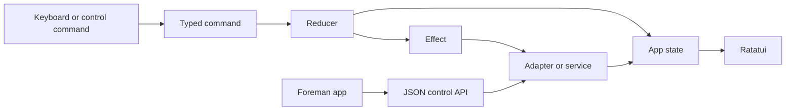

# Foreman architecture

Foreman is a Rust control plane for coding agents in tmux. Ratatui provides the terminal UI. A native macOS app uses the same JSON control API. Rust remains the only owner of tmux discovery, status, sources, and actions.

## System overview

### Components



The main boundaries are:

- `app` owns commands, actions, state, choice, modes, and the pure reducer.
- `ui` renders state and maps input to commands.
- `adapters` talk to tmux and the host system.
- `integrations` classify harnesses and apply native signal.
- `services` provide pull requests, alerts, extensions, links, choices, and control responses.
- source modules aggregate local, SSH, snapshot, and companion pane list.
- `runtime` schedules refresh, executes effects, and returns results to the reducer.

### Pane list and status flow

```text
configured sources
  -> source-local inventory and diagnostics
  -> source-scoped aggregate rows
  -> compatibility classification
  -> matching native evidence overlay
  -> reducer refresh
  -> terminal or control API output
```

The local source queries tmux directly. SSH sources run bounded remote probes. Snapshot sources read validated cached records. Companion sources use the JSON-line protocol. Each row keeps its source ID because tmux pane IDs aren't globally unique.

### Action flow

```text
selection
  -> resolved source-scoped pane
  -> typed effect
  -> source or service adapter
  -> structured result
  -> reducer update and diagnostic
```

The reducer never performs I/O. Failed actions return typed results, so drafts and user alerts stay consistent.

## Trust boundaries

- **User input.** Parse CLI flags, config values, search text, drafts, and pane actions before use.
- **Tmux.** Treat pane list, process data, pane metadata, and captured text as external and possibly stale.
- **Native status.** Accept typed signal only for the matching tool and active runtime key.
- **SSH sources.** Bound execution time, validate source IDs, quote arguments, and turn remote failures into source details.
- **Companion actions.** Require direct send trust. Send capability needs a token, and every transport must preserve that rule.
- **Snapshots.** Validate schema, source ID, freshness, and complete file contents before use.
- **Filesystem state.** Use atomic writes and repo or user-owned state paths.
- **Display focus.** Keep exact display key on the machine that owns the display.
- **GitHub and extensions.** Treat missing tools, authentication, and tool output as extra degraded state.

## Goals and non-goals

The architecture favors predictable state, fast keyboard response, source isolation, and visible failures. It keeps product rules testable behind adapters.

It doesn't aim to replace tmux, duplicate Rust logic in Swift, parse every harness interaction, or make remote destructive actions ready without a contract.

## Invariants

### State and rendering

- `AppState` owns modes, drafts, choice, filter state, cached cards, choices, alerts, and alerts.
- The reducer is pure and emits effects.
- Rendering reads state and has no product side effects.
- Logical choice survives refresh, filtering, and sorting when its target still exists.
- Session and window rows resolve to an actionable visible pane.
- Overlay state stays in the reducer instead of widget-local variables.

### Status authority

- Native signal outranks fallback state for the same harness.
- Native signal can't cross harness boundaries.
- Stale files or scrollback can't create native status.
- Fallback mode remains available when native signals are missing.
- Attention and errors surface immediately. Working-state loss may use bounded debounce.

### Sources and actions

- `SourcePaneId` combines source and pane key.
- One source failure can't erase healthy rows from another source.
- Source refresh and merge work can't block keyboard handling.
- Remote destructive actions stay disabled without an direct contract.
- Tmux focus and display focus report separate outcomes.
- Exact display key never enters SSH, snapshot, or companion payloads.

### Persistence and runtime

- Logs, choices, links, snapshots, registrations, and display records have distinct owners.
- Config values override persisted UI choices when both are direct.
- Atomic writers prevent partial native signals and snapshots.
- Timeouts bound external commands and child processes.
- Startup cache and snapshots always expose their cached source.

## Operating principles

- Map raw keys to typed commands before business logic.
- Keep state transitions in the reducer and I/O in adapters.
- Prefer typed native signal over terminal text.
- Use fake-backed contract tests before live smoke tests.
- Keep extra tools soft-failing and observable.
- Preserve the source key through every row, detail, cache entry, and action.
- Keep terminal and native-app rules aligned through the control API.
- Use exact display IDs instead of titles or process metadata.
- Use isolated tmux servers for smoke tests.
- Keep refresh work outside the input path.

## Checks workflow

Use Harness Kit from the feature worktree:

```bash
hk start <slug> --plan "<intent and validation>" --target .
hk validate --why "<what this proves>" -- <command>
hk sync --target .
hk ready --target .
```

Before handoff:

1. Run focused tests while editing.
2. Run `mise run check`.
3. Use `/spec-sync` when rules changes a contract.
4. Update the owning docs or agent guidance.
5. Run final context review.
6. Sync HK and inspect readiness.

Use `/plan-sync` only for a named historical `.ai/plans/**` artifact.

### Checks layers

| Layer | Purpose |
|---|---|
| Unit and buffer tests | Reducer, rendering, config, status, and policy rules |
| Adapter tests | Tmux, source, tool, pull-request, and alert seams |
| Agent simulation | Repeatable hook and subagent scenarios |
| Live smoke tests | Isolated tmux and real command journeys |
| Native verification | Real Claude, Codex, and Pi tool proof |
| macOS checks | App bundle, control API, keyboard, focus, and snapshots |

When CI fails, inspect the extra `test-results` artifact first. It contains generated `test-results/` and `apps/*/test-results/` paths when those paths exist.

## Decisions

| Decision | Current constraint |
|---|---|
| [0001](decisions/0001-stack-choice.md) | Rust, Ratatui, Clap, Serde, and Tokio form the core stack. |
| [0002](decisions/0002-source-aggregation-and-remote-ssh.md) | Pane list and actions use source-scoped key. |
| [0003](decisions/0003-remote-jump-terminal-activation.md) | Tmux focus and local display focus remain separate. |
| [0004](decisions/0004-source-companion-relay.md) | Companions and snapshots provide trusted, visible fallback paths. |
| [0005](decisions/0005-native-provenance-authority.md) | Tool-native signal requires matching source. |

## Module map

| Path | Ownership |
|---|---|
| `src/app/` | Commands, actions, state, reducer, choice, and UI invariants |
| `src/ui/` | Ratatui rendering, layout, themes, and input presentation |
| `src/runtime.rs` | Event loop, refresh scheduling, effects, and soft failures |
| `src/adapters/tmux.rs` | Tmux discovery, capture, focus, send, rename, spawn, and kill transport |
| `src/integrations/` | Harness recognition, fallback status, hooks, and native signal |
| `src/sources.rs` | Source config, aggregation, details, and action routing |
| `src/source_companion.rs` | JSON-line companion protocol and authorization |
| `src/source_companion_connect.rs` | Companion and reverse-tunnel supervision |
| `src/source_snapshots.rs` | Snapshot and registration persistence |
| `src/source_display/` | Exact machine-local display key and focus |
| `src/services/control_api.rs` | JSON contracts for agents and native clients |
| `src/services/extensions.rs` | Read-only extension tool cards |
| `src/services/linked_repositories.rs` | Direct pane-to-repo links |
| `src/services/notifications.rs` | Transition policy and backend dispatch |
| `src/services/pi_subagents.rs` | Typed Pi subagent activity |
| `src/services/pull_requests.rs` | Pull-request lookup and actions |
| `src/services/ui_preferences.rs` | Persisted UI choices and config precedence |
| `apps/macos-overlay/` | Native app shell and control API client |
| `tests/` | Tool, entrypoint, and end-to-end contracts |

## Where judgment belongs

Humans own product intent, security and privacy choices, release authority, and irreversible operations. Agents can implement bounded changes, run checks, and surface signal. New durable constraints belong in the specification or an architecture decision record. Temporary progress belongs in Harness Kit rather than product documentation.
