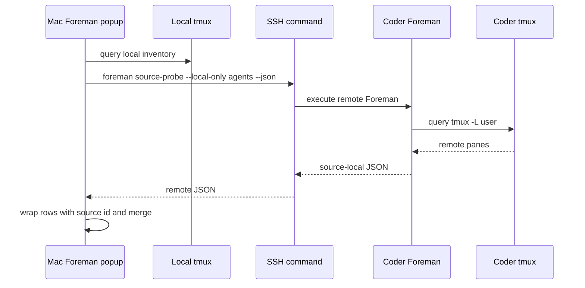
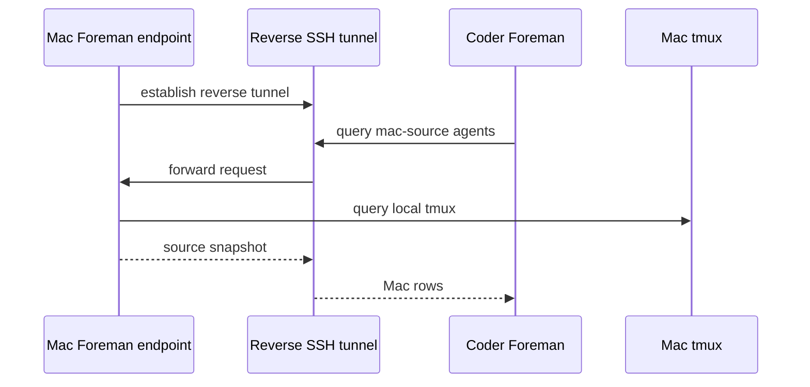
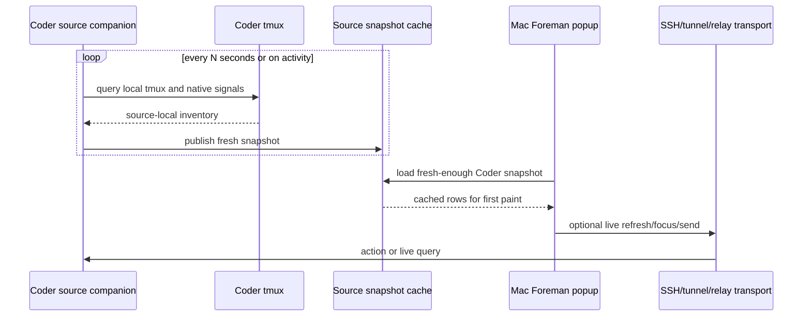
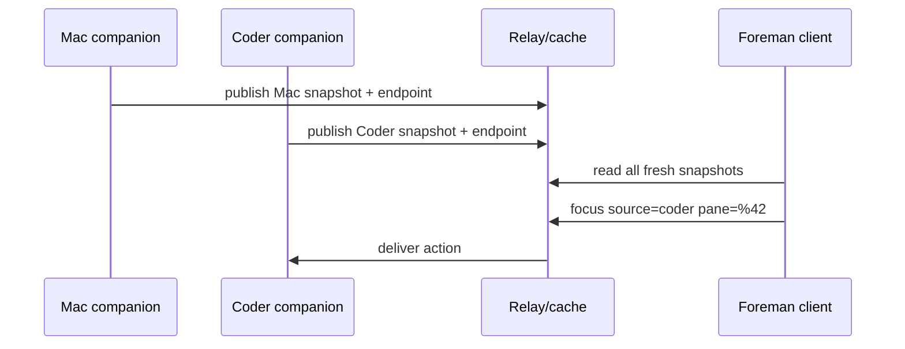
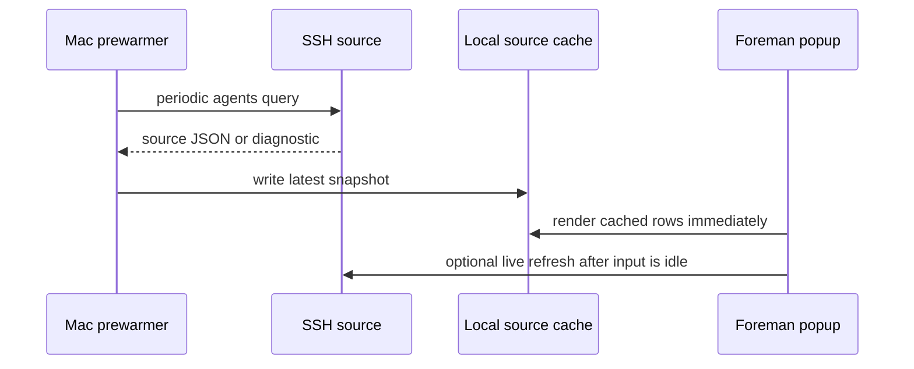
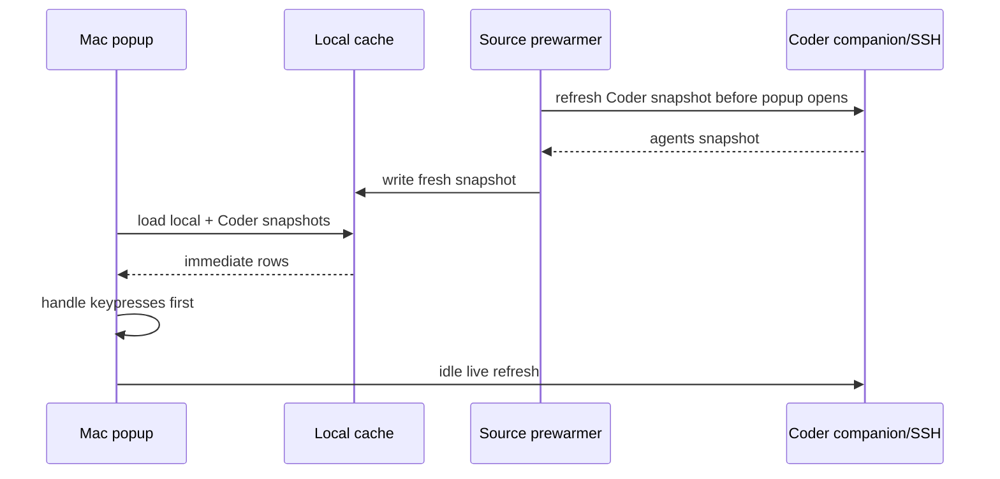
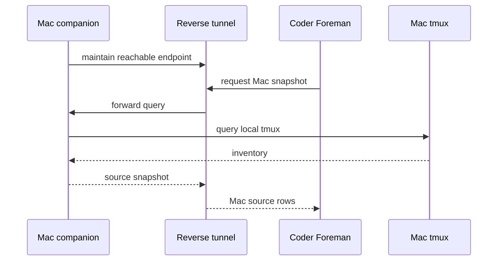
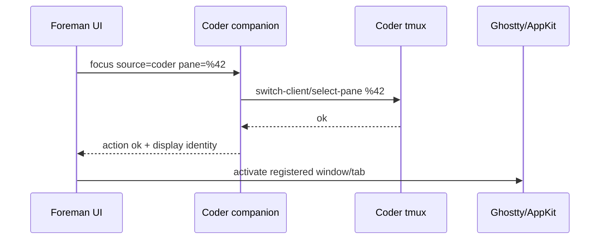

# ADR 0004: Source companion and relay architecture

Status: proposed

## Context

ADR 0002 made Foreman source-aware. A local Foreman process can now query local
tmux plus configured SSH sources such as Coder, merge source-scoped rows, and
route safe actions like focus and send to the selected source. ADR 0003 added the
first jump-to bridge: after focusing a remote tmux pane, Foreman can run a
local activation command to bring the terminal tab that displays that source to
the front.

That architecture is intentionally one-shot and directional:

```text
Mac Foreman → local tmux
Mac Foreman → ssh → Coder foreman source-probe --local-only → Coder tmux
```

It works for Mac → Coder because the Mac can initiate SSH. It does not cleanly
solve the reverse view, where Foreman running on Coder should also be able to
show Mac work, unless the Mac exposes an inbound endpoint or a tunnel exists.
It also leaves first-paint performance dependent on cache freshness plus live
SSH refresh behavior, and terminal activation depends on user-provided title or
script matching instead of registered display identity.

## Problem

Foreman needs a next architecture that can support:

- bidirectional Mac ↔ Coder source visibility without assuming inbound SSH to
  the Mac
- prewarmed source snapshots so popup first paint does not wait on live SSH
- precise source endpoint discovery for tmux server/socket/binary mismatches
- terminal display identity for jump-to behavior without brittle title matching
- failure modes that degrade to stale snapshots and source diagnostics rather
  than blocking the whole operator surface

## Decision summary

Do not replace the working one-shot SSH source immediately. Build the next slice
as a **source companion design and prototype**, with a narrow local companion
first and pluggable transports later.

The proposed direction is:

1. Keep one-shot SSH sources as the stable fallback transport.
2. Add a source companion protocol that can publish source snapshots and accept
   focus/send actions.
3. Use a local cache/prewarmer path first, so popup first paint can be served
   from fresh-enough snapshots before any live network query completes.
4. Treat reverse tunnels and relays as transport options for the companion
   protocol, not as separate product models.

This keeps the proven source-aware UI/action model from ADR 0002 while moving
latency, endpoint discovery, and display registration out of the popup critical
path.

## Current baseline from ADR 0002



Strengths:

- simple mental model
- no daemon lifecycle
- easy to validate with fake SSH
- healthy local rows can render before slow remote rows

Limits:

- reverse direction needs a new network path
- every live remote refresh starts a command unless cache is fresh
- source endpoint discovery is repeated and config-heavy
- terminal display identity is outside Foreman's source model

## Candidate designs

### Option A — Reverse SSH tunnel

A tunnel connects a Coder-side Foreman process back to a Mac-local Foreman
endpoint. The Mac opens or maintains the tunnel, then Coder can query the Mac
through localhost on the Coder side.



Pros:

- enables Coder → Mac without inbound macOS SSH
- reuses SSH trust and existing Coder connectivity
- can carry the same source-probe/control API initially

Cons:

- tunnel lifecycle becomes user-visible unless managed
- action auth and endpoint exposure need explicit design
- does not by itself solve prewarmed local popup state
- fragile if laptop sleeps, network changes, or Coder restarts

Best use: transport for a companion protocol when Mac ↔ Coder bidirectionality is
needed before a general relay exists.

### Option B — Source companion process

A lightweight companion runs near each source. It periodically queries its local
tmux, writes/publishes fresh source snapshots, registers endpoint metadata, and
optionally accepts focus/send actions.



Pros:

- removes expensive source discovery from popup first paint
- centralizes source endpoint facts: tmux server/socket, binary path, host, labels
- can register terminal display identity for robust jump-to
- works with multiple transports: local file, SSH pull, reverse tunnel, relay
- preserves existing source-aware UI and action model

Cons:

- introduces process lifecycle and stale-heartbeat decisions
- needs a small protocol and compatibility story
- must avoid becoming a hidden daemon that users cannot diagnose

Best use: preferred next architecture seam. Prototype locally before adding a
remote transport.

### Option C — Relay/cache service

Sources publish snapshots to a shared relay. Foreman clients read snapshots and
send actions through registered channels.



Pros:

- strongest long-term multi-host model
- naturally bidirectional
- can make every Foreman surface a cache reader first
- good fit if sources expand beyond Mac/Coder

Cons:

- largest auth, persistence, and operations surface area
- overkill for a single user's Mac/Coder loop today
- makes Foreman depend on a service unless carefully optional

Best use: future transport if reverse tunnels or local companion files are too
limited.

### Option D — One-shot SSH plus local prewarmer only

Keep ADR 0002's SSH source unchanged and add a local background job that
periodically runs source refreshes and writes cached snapshots.



Pros:

- smallest implementation step
- improves popup first paint without remote daemon lifecycle
- validates freshness and cache UX before companion complexity

Cons:

- Mac-only control-plane shape remains
- reverse Coder → Mac is unsolved
- endpoint/display registration remains config/script based

Best use: incremental performance slice if companion design is not ready.

## Proposed protocol shape

A source companion should be a narrow protocol around snapshots, health, and
safe actions. It should not own tmux panes or become a general remote shell.

### Registration

```json
{
  "schemaVersion": 1,
  "sourceId": "coder-dev-gpu-1",
  "sourceLabel": "Coder",
  "sourceKind": "companion",
  "host": "alex-furrier-dev-gpu-1",
  "tmux": {
    "serverName": "user",
    "socketPath": "/tmp/tmux-1000/user",
    "tmuxPath": "/home/linuxbrew/.linuxbrew/bin/tmux",
    "tmuxVersion": "tmux 3.6a"
  },
  "display": {
    "app": "Ghostty",
    "bundleId": "com.mitchellh.ghostty",
    "windowId": "...",
    "tabId": "...",
    "title": "Coder"
  },
  "endpoints": {
    "query": "local-file|ssh|reverse-tunnel|relay",
    "actions": ["focus", "send"]
  },
  "lastHeartbeatUnixMs": 1780000000000
}
```

### Snapshot

Snapshots should reuse the current control API `AgentsResponse` shape and add
only companion envelope metadata. The entries inside `response` are
**source-local** entries, exactly like `source-probe --local-only` output. The
consumer wraps those entries with the configured source id/label when merging the
snapshot. A companion snapshot must not contain already-wrapped `sourcePaneId`
values from a different Foreman client, because that would make reconfiguration
and relabeling ambiguous.

```json
{
  "schemaVersion": 1,
  "sourceId": "coder-dev-gpu-1",
  "capturedAtUnixMs": 1780000000000,
  "expiresAtUnixMs": 1780000002500,
  "agentsResponseSchemaVersion": 2,
  "response": {
    "schemaVersion": 2,
    "generatedAtUnixMs": 1780000000000,
    "inventory": {
      "totalSessions": 0,
      "totalWindows": 0,
      "totalPanes": 0,
      "visibleSessions": 0,
      "visibleWindows": 0,
      "visiblePanes": 0
    },
    "entries": [],
    "diagnostics": []
  },
  "health": { "status": "ok", "message": null }
}
```

The Foreman UI should treat snapshots as read models. Source rows remain wrapped
with the configured source id exactly as they are in ADR 0002.

### Actions

Safe action requests should be explicit and source-scoped:

```json
{
  "schemaVersion": 1,
  "requestId": "uuid",
  "sourceId": "coder-dev-gpu-1",
  "action": "focus",
  "paneId": "%42",
  "createdAtUnixMs": 1780000000000
}
```

Action responses should map back into the existing `ActionResponse` shape so
TUI, popup, and overlay behavior does not fork.

### Protocol invariants

- Snapshot `sourceId` is required to match the configured source consuming it. A
  mismatch is ignored with `source.snapshot.source-id-mismatch`.
- Entries inside `response` are source-local. Only the consuming Foreman client
  wraps them with `sourceId`, `sourceLabel`, and `sourcePaneId`.
- `requestId` is required for action log correlation and idempotency. Replayed
  requests should return the prior result when the transport can remember it;
  otherwise they must be safe to retry only for idempotent actions such as
  focus.
- Action transports are disabled by default unless the transport has an explicit
  local trust boundary. Reverse tunnel and relay proofs must define auth before
  accepting `send`.
- Focus responses must distinguish tmux focus from display activation. A remote
  tmux focus can succeed even when terminal/tab activation is unavailable; the
  operator-visible result should not collapse those into one failure.

## Snapshot store ownership

The first implementation should introduce one module that owns file-backed
registration and snapshot state before adding any reverse tunnel or relay
transport.

Proposed module responsibility:

```text
SourceSnapshotStore
  publish_registration(source_id, registration)
  publish_snapshot(source_id, snapshot)
  load_snapshot(source_id, freshness_policy) -> snapshot | diagnostic
  prune_expired(now)
```

Store invariants:

- Writers use temp-file + atomic rename so popup readers never observe partial
  JSON.
- Readers ignore invalid, partial, schema-too-new, or source-id-mismatched files
  and return source diagnostics instead of panicking or blocking first paint.
- Snapshot freshness policy lives in the store, not in individual runtime call
  sites.
- Registration heartbeat and snapshot expiry are separate: stale registration
  explains endpoint health, stale snapshot explains row freshness.
- Duplicate registration for the same source id is rejected unless it has the
  same endpoint identity or an explicit replacement marker.
- Retention is bounded; expired snapshots can be pruned after they are no longer
  useful for diagnostics.

This module is the deep seam. Runtime, popup, overlay control paths, prewarmers,
and future transports should call the store instead of reimplementing TTL,
schema, and atomic-file behavior.

## Cache freshness model

Popup first paint should not block on a live remote source when a snapshot is
fresh enough.

Recommended freshness tiers:

| Tier | Age | UI behavior |
|---|---:|---|
| fresh | ≤ 2s | Render normally and refresh in background. |
| warm | ≤ 15s | Render with subtle stale marker and refresh in background. |
| stale | ≤ 5m | Render below healthy/fresh rows with source diagnostic. |
| expired | > 5m | Do not render rows by default; show source diagnostic only. |

A source action against stale rows may still be attempted if the source endpoint
is available, but the action response must report whether the target pane was
missing or changed.

## Sequence diagrams

### Mac first paint from prewarmed Coder source



### Coder viewing Mac through reverse tunnel



### Focus remote source with registered display identity



## Failure modes

| Failure | Expected behavior | Diagnostic |
|---|---|---|
| source offline | Keep healthy sources visible; show source diagnostic. | `source.companion.offline` |
| snapshot fresh but live refresh slow | Render snapshot, defer merge while user is navigating. | timing logs, no blocking alert |
| snapshot expired | Hide rows by default; show source diagnostic. | `source.snapshot.expired` |
| reverse tunnel down | Coder view shows Mac source unavailable; Mac local view still works. | `source.transport.unavailable` |
| companion schema too new | Ignore rows; show unsupported schema diagnostic. | `source.companion.schema-unsupported` |
| terminal tab closed | tmux focus may succeed; activation reports unavailable. | `source.display.unavailable` |
| tmux server mismatch | Source doctor reports configured and discovered tmux endpoint. | `source.tmux.endpoint-mismatch` |
| action against stale pane | Return action failure with missing pane detail. | `source.action.target-missing` |
| relay unavailable | Fall back to local cache or one-shot SSH if configured. | `source.relay.unavailable` |

## Validation plan

The companion/relay work must preserve the popup performance guarantees added in
ADR 0002's implementation.

Required automated checks:

```bash
cargo test --lib sources --quiet
cargo test --lib runtime --quiet
cargo test --test runtime_profiling -- --ignored
scripts/smoke-popup-key-latency.sh
mise run verify-ux
```

Performance scenarios:

- local-only baseline
- all-source idle baseline
- all-source refresh-overlap stress
- companion fresh snapshot first paint
- companion stale snapshot diagnostic
- source offline while local rows remain visible
- action against stale/missing remote pane

Acceptance criteria:

- `scripts/smoke-popup-key-latency.sh` passes with zero slow `move-selection`
  actions in all scenarios.
- Local-only and all-source-idle bursts process the configured key count within
  the script budget; all-source idle must not exceed the local-only wall time by
  more than the script's relative overhead budget.
- Refresh-overlap logs stable deferred-merge and deferred-apply markers before
  the test passes.
- Render max stays under the smoke script budget for local-only, all-source idle,
  and overlap scenarios.
- A fresh companion snapshot fixture renders source rows before any live network
  refresh is released.
- A stale snapshot fixture renders rows with a source diagnostic; an expired
  snapshot fixture hides rows by default and shows only the diagnostic.
- Corrupt, partial, unsupported-schema, and source-id-mismatched snapshot files
  never hide healthy local rows.
- Every source failure degrades to a source diagnostic, not a whole-dashboard
  failure.

Implementation PRs should record the actual local-only, all-source-idle,
overlap, and companion-cache timings in HK validation evidence. If Swift overlay,
app bundle, keyboard/focus, screenshot, or control-API paths change, also run
`mise run validate-macos-overlay-change`.

## Non-goals for the first companion spike

- Auto-installing remote Foreman binaries.
- Clipboard, image, browser, or port forwarding.
- Replacing the working one-shot SSH source.
- Remote destructive actions such as kill, rename, or spawn.
- A network relay that requires hosted infrastructure.
- A hidden background daemon without `doctor`, logs, and lifecycle controls.

## Recommended implementation slices

### Slice 0 — characterization baseline

- Preserve current one-shot SSH behavior with source aggregation tests.
- Capture current popup key-latency numbers with `scripts/smoke-popup-key-latency.sh`.
- Add fixtures for fresh, stale, expired, corrupt, schema-too-new, and
  source-id-mismatched snapshots before wiring them into runtime.

### Slice 1 — snapshot store only

- Add the `SourceSnapshotStore` read/write module and fixture tests.
- Implement atomic writes, strict reads, freshness classification, source-id
  validation, schema handling, and pruning.
- Do not add a daemon, reverse tunnel, relay, or generic transport interface yet.

### Slice 2 — read-only runtime cache integration

- Teach source aggregation/runtime to load fresh-enough snapshots behind explicit
  config.
- Keep live one-shot SSH refresh as fallback and eventual source of truth.
- Prove corrupt/expired/mismatched snapshots produce diagnostics without hiding
  healthy local rows.

### Slice 3 — SSH prewarmer writer

- Add an explicit prewarmer command or mode that refreshes configured SSH sources
  and writes snapshots through `SourceSnapshotStore`.
- Compare prewarmed first paint against today's live SSH path.
- Keep source actions routed through the existing SSH command path.

### Slice 4 — local companion snapshot command

- Add a hidden or experimental command that writes a registration and snapshot
  for the current local tmux endpoint.
- Include endpoint facts: tmux server/socket, tmux binary path/version, source id,
  heartbeat time, and supported actions.
- Keep lifecycle manual/explicit until `doctor` can explain it.

### Slice 5 — reverse tunnel proof

- Prototype Coder querying a Mac companion through a manually established reverse
  tunnel.
- Document tunnel setup, teardown, auth, and failure diagnostics.
- Do not generalize a transport framework until this creates a second concrete
  transport beside local file/SSH pull.

### Slice 6 — display registration

- Extend registration with terminal display identity.
- Replace title-only activation scripts with registered display activation where
  available.
- Keep `activation_command` as fallback.

### Slice 7 — relay evaluation

- Evaluate relay/cache service only after local snapshot store, prewarmer, and
  reverse tunnel proof reveal concrete limits.
- Do not add hosted infrastructure or make Foreman depend on a relay in this
  implementation series.

## Decision checkpoints

Before shipping a daemon-like companion by default, answer:

- Who starts it: Foreman, shell integration, launchd/systemd, or explicit user
  command?
- How does `foreman doctor` explain companion health and stale snapshots?
- What auth boundary protects action endpoints?
- What is the compatibility story when source companion schema changes?
- What is the fallback path when the companion is absent?

The safe answer for now is: one-shot SSH remains the stable fallback, and any
companion/relay behavior must be opt-in until its lifecycle and diagnostics are
proven.
